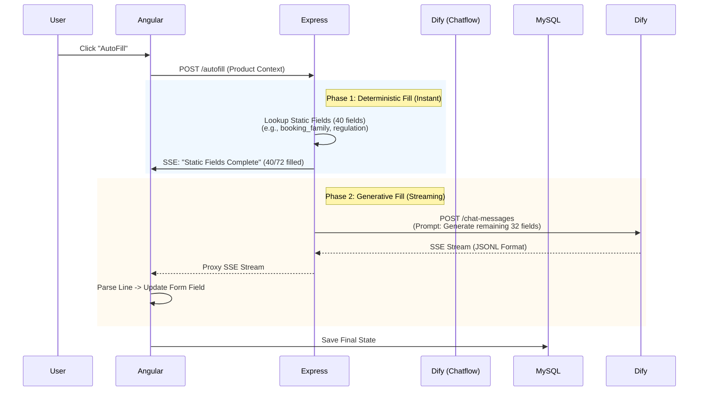

## Executive Recommendation

**Recommended Approach: Approach D+ (Deterministic-Generative Split on Dify Chatflow)**

Do **not** choose Approach A (Parallel Workflow) or Approach B (Pure Chatflow). Approach A is architecturally fragile on Dify (merge logic + streaming limitations), and Approach B risks high latency and parsing errors on 72 fields.

Instead, adopt a **Hybrid Data Strategy** hosted on **Dify Chatflow**.

**The Core Insight:**
You are asking the LLM to do work it is bad at (lookup/categorization) and slow at (generating 10k+ tokens).
*   **~40 of the 72 fields are Deterministic:** They depend solely on `product_category` or `booking_location` (e.g., `booking_family`, `primary_regulation`). These should **never** be generated by an LLM. They should be looked up in Express/Node via a mapping table.
*   **~32 of the 72 fields are Generative:** These require reasoning (e.g., `business_rationale`, `market_risk`). These go to the LLM.

**Why this wins:**
1.  **Latency:** Reduces LLM output tokens by ~55% (from 10,800 to ~4,500). Estimated generation time drops from 9 mins to **< 90 seconds**.
2.  **Accuracy:** Deterministic fields have 100% key-match and value accuracy. LLM only handles ambiguous fields.
3.  **UX:** By streaming **JSONL (JSON Lines)** from Dify, your Angular frontend can update fields **one-by-one** as they generate, creating a "filling up" effect rather than a spinner.
4.  **Simplicity:** Single Dify App (Chatflow). No complex Python merge nodes. Logic split between Express (static) and Dify (dynamic).

---

## 1. Architectural Blueprint

### High-Level Flow


### Component Responsibilities

| Component | Responsibility |
| :--- | :--- |
| **Angular** | Renders form. Listens to SSE. **Crucial:** Parses incoming JSONL lines and updates specific form controls immediately. |
| **Express** | **Orchestrator.** 1) Identifies `product_category`. 2) Fills static fields from local config. 3) Proxies Dify SSE. 4) Merges static + dynamic results before DB save. |
| **Dify (Chatflow)** | **Reasoning Engine.** Receives context + list of *only* the 32 dynamic keys. Outputs **JSONL** (one JSON object per line). |
| **MySQL** | Stores final merged result. |

---

## 2. Solving the Specific Pain Points

### Problem 1: Latency (9 minutes → < 2 minutes)
**Solution:** Token Reduction.
*   **Current:** 72 fields × 150 tokens = 10,800 tokens.
*   **New:** 32 fields × 100 tokens (concise) = 3,200 tokens.
*   **Speed Gain:** ~3.5x faster generation.
*   **Perceived Speed:** Static fields populate instantly (0ms). User sees activity immediately.

### Problem 2: Field Key Mismatch (11% → 100%)
**Solution:** Schema Enforcement + Pre-filtering.
*   **Static Fields:** Keys are hardcoded in Express. 0% hallucination risk.
*   **Dynamic Fields:** The Dify System Prompt will contain the **exact list** of the remaining 32 keys.
*   **Prompt Instruction:** *"You must output valid JSONL. Each line must be a single object: `{"key": "exact_key_name", "value": "...", "confidence": 95}`. Use ONLY keys from this list: [list_of_32_keys]."*

### Problem 3: UX (Raw JSON → "Form Filling" Animation)
**Solution:** JSONL Streaming.
Instead of waiting for a closing `}` of a massive JSON object, the LLM outputs:
```json
{"key": "business_rationale", "value": "Hedging FX exposure...", "confidence": 90}
{"key": "market_risk", "value": "Sensitive to GBP/USD volatility...", "confidence": 85}
```
**Angular Logic:**
1.  Maintain a `buffer` string.
2.  On SSE chunk: `buffer += chunk`.
3.  Split `buffer` by `\n`.
4.  Keep the last incomplete line in `buffer`.
5.  Parse complete lines as JSON.
6.  Call `formGroup.get(key).setValue(data.value)`.
7.  **Result:** The user watches fields populate one by one in real-time.

### Problem 4: Reliability (Fragile Merge Code)
**Solution:** Move Merge to Express (TypeScript).
*   Dify only returns the 32 dynamic fields.
*   Express holds the "Master List" of 72 fields.
*   Express initializes the 72-field object with Static values.
*   Express overwrites with Dify values as they stream/complete.
*   No Python string concatenation. No Markdown fence parsing.

---

## 3. Implementation Details

### A. Field Classification (The "Split")
You must audit your 72 fields. Example split:

| Category | Fields (Examples) | Strategy |
| :--- | :--- | :--- |
| **Static (Lookup)** | `booking_family`, `booking_typology`, `primary_regulation`, `settlement_method`, `data_privacy` | **Express Lookup Table.** Keyed by `product_category` + `booking_location`. |
| **Dynamic (LLM)** | `business_rationale`, `market_risk`, `credit_risk`, `esg_assessment`, `pricing_methodology` | **Dify Chatflow.** Requires reasoning based on product description. |
| **Hybrid** | `notional_amount`, `tenor` | **Extract from Input.** Do not ask LLM. Pass through from API input. |

### B. Dify Chatflow Configuration
1.  **App Type:** Chatflow (not Workflow). Chatflow has more stable SSE handling for long responses.
2.  **Model:** Claude 3.5 Sonnet (Fast + High Instruction Following).
3.  **System Prompt:**
    ```text
    You are an NPA AutoFill Agent.
    TASK: Generate values for the following 32 fields ONLY: [list_keys].
    FORMAT: Output strictly in JSONL (JSON Lines). One object per line.
    SCHEMA: {"key": "string", "value": "string", "lineage": "ADAPTED", "confidence": "number", "source": "string"}
    CONSTRAINTS:
    - Do not output markdown code blocks (```json).
    - Do not output conversational text.
    - Keep values concise (max 3 sentences).
    - If unsure, set confidence < 50.
    CONTEXT: [RAG Knowledge Base Injected Here]
    ```
4.  **Variables:** Pass `product_description`, `static_fields_already_filled` (for context), `user_input_context`.

### C. Angular Frontend (SSE Handler)
```typescript
// autofill.service.ts
processStream(event: MessageEvent) {
  const text = event.data;
  this.buffer += text;
  
  const lines = this.buffer.split('\n');
  this.buffer = lines.pop() || ''; // Keep incomplete line

  lines.forEach(line => {
    if (!line.trim()) return;
    try {
      const fieldData = JSON.parse(line);
      // Update specific form control immediately
      this.npaForm.patchValue({ [fieldData.key]: fieldData.value });
      // Visual feedback: Highlight the field that just updated
      this.highlightField(fieldData.key); 
    } catch (e) {
      console.warn('Parse error on stream chunk', e);
    }
  });
}
```

### D. Express Backend (Proxy & Merge)
```javascript
// No complex merge logic needed during stream. 
// Just proxy Dify SSE to Angular.
// On 'end' event, save the final combined state to MySQL.

app.post('/autofill', async (req, res) => {
  // 1. Calculate Static Fields
  const staticFields = getStaticFields(req.body.product_category);
  
  // 2. Initiate Dify Stream
  const difyStream = await difyClient.createChatMessage({
    inputs: { ...req.body, static_context: staticFields },
    response_mode: 'streaming'
  });

  // 3. Pipe Dify Stream to Angular
  difyStream.pipe(res);

  // 4. On Close, Merge & Save to DB
  difyStream.on('end', () => {
     saveToMySQL({ ...staticFields, ...dynamicFieldsFromStream });
  });
});
```

---

## 4. Addressing Your Specific Questions

**Q: If chatflow: How should we structure the LLM output?**
**A:** **JSONL (Newline Delimited JSON).**
*   **Why:** It is machine-parseable line-by-line (enabling real-time field updates) but human-readable (you can read the lines).
*   **Avoid:** Markdown tables (hard to parse stream), Giant JSON block (user waits for end), Prose (unparseable).

**Q: If parallel workflow: How do we solve the "user sees raw JSON" problem?**
**A:** **Don't use Parallel Workflow.** Dify's workflow engine aggregates branch outputs before sending the final "Answer" node stream. You cannot easily stream intermediate branch results to the frontend without custom webhook hacks. Chatflow is designed for streaming the *thought process* or *answer*.

**Q: Is there a way to get Claude to generate 72 fields significantly faster?**
**A:** **Yes, reduce the count.**
*   Do not ask Claude for `booking_family`. It's a lookup.
*   Do not ask Claude for `notional_amount`. It's in the input.
*   Ask Claude *only* for fields requiring semantic understanding.
*   **Prompt Compression:** Remove all "business rules" from the prompt that are covered by the Static Lookup. Only keep policy rules relevant to Risk/Narrative fields.

**Q: Should we separate "quick fields" from "analytical fields"?**
**A:** **Absolutely.** This is the core of the recommendation.
*   **Quick Fields:** Express/Node Lookup (0 latency).
*   **Analytical Fields:** Dify LLM (Streaming).
*   **Input Fields:** Pass-through from API (0 latency).

**Q: What output format balances human-readability with machine-parseability?**
**A:** **JSONL.**
*   *Machine:* `JSON.parse(line)` is trivial.
*   *Human:* If you log the stream, it looks like a list of completed tasks.
*   *Streaming:* As soon as a newline hits, the field is "done" and can be rendered.

---

## 5. Risk Mitigation

| Risk | Mitigation |
| :--- | :--- |
| **LLM breaks JSONL format** | Set `temperature: 0.1`. Use Claude 3.5 Sonnet (highly compliant). Add a regex fallback in Angular to clean minor syntax errors. |
| **Stream disconnects** | Angular should have a "Retry" button. Express should save partial progress to a temporary cache so user doesn't lose filled fields. |
| **Static Lookup Drift** | Regulations change. Create an Admin UI in Angular to update the Express Static Mapping JSON without code deploys. |
| **Hallucinated Keys** | The System Prompt explicitly lists the 32 allowed keys. Express validates incoming keys against the whitelist before applying to Form. |

## 6. Next Steps (Action Plan)

1.  **Audit Fields (Day 1):** Classify all 72 fields into Static, Dynamic, and Pass-through. Create the Express Lookup JSON.
2.  **Prototype JSONL Streaming (Day 2):** Create a simple Dify Chatflow that outputs 5 test fields in JSONL. Verify Angular can parse and update the form in real-time.
3.  **Prompt Engineering (Day 3):** Refine the System Prompt to enforce the 32-key constraint and conciseness (max 3 sentences).
4.  **Integration (Day 4):** Connect Express Static Lookup + Dify Stream. Implement DB persistence on stream end.
5.  **UAT (Day 5):** Test with real NPA examples. Measure time-to-first-field and time-to-complete.

This approach respects your constraint to stay on Dify, solves the latency issue by reducing token load, solves the UX issue via JSONL streaming, and solves the accuracy issue by removing the LLM from deterministic tasks.
