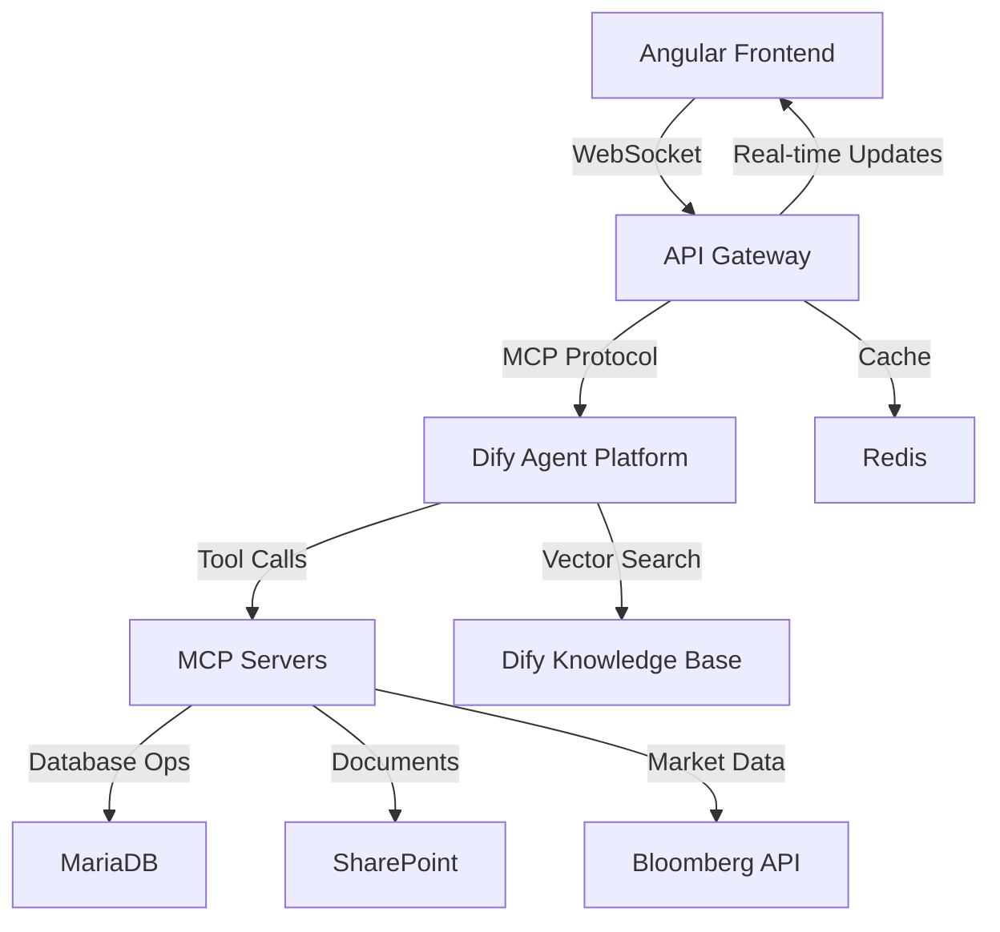

# NPA Multi-Agentic System Architecture

## Executive Summary

This document outlines the comprehensive system architecture for the New Product Approval (NPA) multi-agentic workbench, integrating conversational AI, workflow automation, and enterprise data management. The architecture leverages Dify for agent orchestration, Angular for the frontend, MariaDB for persistence, MCP servers for integration, and Redis for caching.

---

## 1. Information Architecture

### 1.1 Data Domains

#### Core NPA Data Model
```
📋 NPA Entity
├── Product Specification (Name, Type, Classification)
├── Business Context (Rationale, Desk, Business Unit)
├── Risk Assessment (Market, Credit, Operational)
├── Operational Details (Systems, Processes, Settlement)
├── Regulatory Framework (Compliance, Documentation)
├── Approval Workflow (Status, Approvers, Timeline)
└── Audit Trail (Decisions, Changes, History)

📊 Supporting Entities
├── Templates (Auto-fill patterns, Field mappings)
├── Historical NPAs (Similarity matching, Learning data)
├── Policy Documents (Regulatory requirements, Guidelines)
├── Counterparties (Credit ratings, Relationship data)
├── Products (Classifications, Risk profiles)
└── Users (Roles, Permissions, Workflow assignments)
```

#### Information Flow Patterns
```
🔄 Data Lifecycle:
User Input → Agent Processing → Knowledge Enrichment → Validation → Storage → Workflow → Approval → Archive

📈 Data Sources:
• User Conversations (Primary input)
• Historical NPAs (Pattern matching)
• Policy Documents (Compliance validation)
• External APIs (Market data, Sanctions lists)
• System Integrations (Murex, Bloomberg, CFETS)
```

### 1.2 Knowledge Base Structure

#### SharePoint Integration
```
📚 SharePoint Document Library:
/NPA_Knowledge_Base/
├── /Historical_NPAs/
│   ├── TSG2339_CNY_IRS_Swap_Connect.pdf
│   ├── TSG1917_FX_Options.pdf
│   └── [1,784 historical records]
├── /Policy_Documents/
│   ├── MAS_656_Guidelines.pdf
│   ├── PBOC_Swap_Connect_Framework.pdf
│   └── DBS_Risk_Framework.pdf
├── /Templates/
│   ├── NPA_Standard_Template.docx
│   ├── Risk_Assessment_Templates/
│   └── Classification_Rules.xlsx
└── /Reference_Data/
    ├── Product_Classifications.xlsx
    ├── Approval_Matrix.xlsx
    └── Counterparty_Database.xlsx
```

#### Dify Knowledge Base
```
🧠 Vector Embeddings:
• NPA Similarity Matching (Semantic search)
• Policy Q&A (Regulatory guidance)
• Template Auto-completion (Field suggestions)
• Risk Pattern Recognition (Historical analysis)

🔍 Search Capabilities:
• Natural language queries
• Multi-modal document retrieval
• Contextual recommendations
• Real-time policy updates
```

---

## 2. Agentic Architecture

### 2.1 Domain Agents (NPA-Specific)

#### Agent Hierarchy
```
🎯 Master Orchestrator
├── 🚀 Product Ideation Agent
├── 🏷️ Classification Agent
├── 📄 Template Auto-Fill Engine
├── 🧠 ML Prediction Agent
├── 🔍 KB Search Agent
├── 💬 Conversational Diligence Agent
├── 🚫 Prohibited List Checker
└── 🎯 Approval Orchestration Agent
```

#### Detailed Agent Specifications

##### 🚀 Product Ideation Agent
```yaml
Purpose: Initial conversation & requirement gathering
Triggers:
  - User initiates "Chat with Agent"
  - Template selection from UI
Capabilities:
  - Natural language understanding
  - Contextual question generation
  - Product requirement extraction
  - Business case development
Outputs:
  - Structured product requirements
  - Business context summary
  - Initial classification hints
Integration:
  - Dify Conversation API
  - Angular Chat Interface
  - Conversational history storage
```

##### 🏷️ Classification Agent
```yaml
Purpose: Product type determination & routing
Triggers:
  - Product details finalized
  - Manual classification request
Logic:
  - Rule-based classification (Existing/New/Variation)
  - Template selection algorithm
  - Approval track determination
Capabilities:
  - Pattern matching against historical NPAs
  - Regulatory framework identification
  - Complexity scoring
Outputs:
  - Product classification
  - Selected template ID
  - Approval workflow route
Data Sources:
  - Product taxonomy (MariaDB)
  - Classification rules (SharePoint)
  - Historical patterns (Dify KB)
```

##### 📄 Template Auto-Fill Engine
```yaml
Purpose: Intelligent form population
Triggers:
  - Classification complete
  - Template selected
  - Manual field assistance
Process:
  1. Template matching (95% similarity → TSG2339)
  2. Field adaptation (User requirements → Template fields)
  3. Lineage tracking (AUTO/ADAPTED/MANUAL)
  4. Confidence scoring (0-100%)
Capabilities:
  - Semantic field mapping
  - Value adaptation logic
  - Cross-border compliance validation
  - Document relationship tracking
Outputs:
  - Pre-filled NPA form (78% completion)
  - Field lineage metadata
  - Manual input requirements
  - Adaptation explanations
```

##### 🧠 ML Prediction Agent
```yaml
Purpose: Timeline & outcome forecasting
Models:
  - Approval timeline prediction (6-8 days)
  - Bottleneck identification
  - Success probability (92% confidence)
  - Loop-back likelihood
Training Data:
  - 1,784 historical NPAs
  - Approval patterns
  - Seasonal variations
  - Complexity factors
Outputs:
  - Timeline forecast (best/likely/worst case)
  - Risk factors
  - Optimization recommendations
  - Confidence intervals
```

##### 🎯 Approval Orchestration Agent
```yaml
Purpose: Workflow management & optimization
Responsibilities:
  - Approver assignment (5-party matrix)
  - SLA monitoring
  - Parallel routing optimization
  - Escalation management
Intelligence:
  - Workload balancing
  - Calendar integration
  - Urgency assessment
  - Dependency tracking
Outputs:
  - Approval sequences
  - Timeline optimization
  - Escalation triggers
  - Status notifications
```

### 2.2 Utility Agents (Shared Services)

#### Infrastructure Agent Grid
```
🧠 RAG Engine ←→ 📄 Doc Processing ←→ 🔄 State Manager
    ↕                    ↕                    ↕
🔗 Integration Hub ←→ 🛡️ Audit Logger ←→ 🔔 Notification
    ↕                    ↕                    ↕
📊 Analytics ←→ 🔄 Loop-Back Handler ←→ 🗄️ Data Retrieval
```

#### Critical Utility Services

##### 🧠 RAG Engine
```yaml
Purpose: Vector search & semantic retrieval
Technology: Dify Vector Database + OpenAI Embeddings
Capabilities:
  - Similarity search (NPAs, policies, templates)
  - Multi-modal document understanding
  - Contextual recommendations
  - Real-time knowledge updates
Performance:
  - 94% hit rate
  - <500ms response time
  - 234 queries/hour (current load)
```

##### 🔄 State Manager
```yaml
Purpose: Workflow orchestration & dependencies
Technology: Redis + Custom state machine
Capabilities:
  - Multi-step workflow coordination
  - Agent handoff management
  - Dependency tracking
  - Parallel execution control
Monitoring:
  - 23 active workflows
  - 2 current loops
  - 100% state consistency
```

##### 🔗 Integration Hub
```yaml
Purpose: External system connectivity
Integrations:
  - Bloomberg API (Market data)
  - CFETS (CNY trading platform)
  - Murex (Trading system)
  - SharePoint (Document management)
  - OFAC/MAS APIs (Sanctions screening)
Performance:
  - 456 API calls/hour
  - 320ms average latency
  - 99.2% uptime
```

---

## 3. System Architecture

### 3.1 Technology Stack

#### Frontend Layer
```
🌐 Angular 17+ Application
├── 📱 Progressive Web App (PWA)
├── 🎨 Tailwind CSS + LucideIcons
├── 🔄 Real-time WebSocket connections
├── 📊 Chart.js for analytics visualization
├── 📝 Markdown rendering for agent responses
└── 🔒 OAuth 2.0 + JWT authentication

📁 Component Architecture:
src/app/
├── components/npa/
│   ├── chat-interface/          # Conversational UI
│   ├── dashboard/               # Agent monitoring
│   └── workflow/                # Approval tracking
├── services/
│   ├── dify/                    # Agent communication
│   ├── api/                     # Backend REST APIs
│   └── websocket/               # Real-time updates
└── shared/
    ├── guards/                  # Authentication
    └── interceptors/            # HTTP middleware
```

#### Backend Services Layer
```
🖥️ Node.js/Express API Gateway
├── 🔐 Authentication Service (JWT + RBAC)
├── 🔄 WebSocket Service (Real-time updates)
├── 📡 MCP Server Orchestration
├── 🗄️ Database Access Layer (MariaDB ORM)
├── 📄 Document Processing Pipeline
├── 🔔 Notification Service (Email/Teams)
└── 📊 Analytics & Logging Service

🔌 MCP Servers (Model Context Protocol):
├── NPA-Database-MCP (MariaDB operations)
├── SharePoint-MCP (Document management)
├── Bloomberg-MCP (Market data)
├── CFETS-MCP (CNY trading data)
├── OFAC-Sanctions-MCP (Compliance screening)
└── Dify-Agent-MCP (AI orchestration)
```

#### Data Layer
```
🗄️ MariaDB (Primary Database)
├── npa_workflows (Core workflow data)
├── npa_templates (Form templates & rules)
├── historical_npas (Learning dataset)
├── user_sessions (Authentication & preferences)
├── audit_logs (Compliance & traceability)
├── approval_matrix (Routing rules)
└── integration_cache (External data cache)

⚡ Redis Cache Layer
├── Session management
├── Real-time agent states
├── API response caching
├── WebSocket connection pools
└── ML model predictions cache

📚 Knowledge Storage
├── Dify Vector Database (Embeddings)
├── SharePoint (Document repository)
├── MariaDB (Structured metadata)
└── Redis (Hot knowledge cache)
```

### 3.2 Agent Integration Architecture

#### Dify Integration Pattern
```
🤖 Dify Platform
├── 🎯 Agent Workflows (Domain agents)
├── 🧠 Knowledge Bases (Vector storage)
├── 🔗 External APIs (MCP integrations)
├── 📝 Conversation Memory
└── 🎛️ Agent Orchestration Engine

🔌 MCP Server Bridge
├── Real-time agent communication
├── State synchronization
├── Tool execution coordination
├── Error handling & recovery
└── Performance monitoring
```

#### Agent Communication Flow


### 3.3 Deployment Architecture

#### Production Environment
```
☁️ Cloud Infrastructure (Azure/AWS)
├── 🌐 CDN (Angular static assets)
├── ⚖️ Load Balancer (Multi-instance API)
├── 🖥️ Application Servers (Node.js cluster)
├── 🗄️ Database Cluster (MariaDB HA)
├── ⚡ Redis Cluster (Cache redundancy)
├── 📄 Document Storage (SharePoint Online)
├── 🤖 Dify Cloud (Agent platform)
└── 📊 Monitoring (Prometheus + Grafana)

🔒 Security Layers
├── WAF (Web Application Firewall)
├── API Rate Limiting
├── Database encryption at rest
├── TLS 1.3 in transit
├── OAuth 2.0 + RBAC
└── Audit logging compliance
```

#### Development & Testing
```
🛠️ Development Environment
├── 🐳 Docker Compose (Local stack)
├── 🧪 Jest + Cypress (Testing)
├── 🔄 CI/CD Pipeline (GitHub Actions)
├── 📋 API Documentation (OpenAPI/Swagger)
└── 🎮 Mock MCP Servers (Development)

🔄 Data Flow Testing
├── Unit tests (Individual agents)
├── Integration tests (Agent workflows)
├── E2E tests (Complete NPA journey)
├── Load tests (Agent performance)
└── Security tests (Penetration testing)
```

---

## 4. Integration Mapping

### 4.1 Information ↔ Agentic Mapping

#### Data-Driven Agent Behavior
```
📊 NPA Data → 🤖 Agent Actions

Historical NPAs → KB Search Agent → Similarity recommendations
Policy Documents → Classification Agent → Compliance validation
User Preferences → Conversational Agent → Personalized experience
Approval History → ML Prediction Agent → Timeline forecasts
Risk Patterns → Template Auto-Fill → Proactive risk assessment
```

#### Agent-Generated Information
```
🤖 Agent Outputs → 📊 Data Storage

Classification results → Product taxonomy updates
Template adaptations → Learning dataset growth
Approval patterns → ML model training data
User interactions → Conversational improvement data
Performance metrics → System optimization insights
```

### 4.2 Agentic ↔ System Mapping

#### Agent Infrastructure Requirements
```
🤖 Domain Agents → 🖥️ System Resources

Product Ideation → WebSocket + Session storage
Classification → Rule engine + Pattern matching DB
Template Auto-Fill → Vector search + Field mapping cache
ML Prediction → GPU compute + Historical data warehouse
KB Search → Vector database + Document indexing
Conversational → Real-time messaging + Context memory
Prohibited Check → External API + Compliance cache
Approval Orchestration → Workflow engine + State management
```

#### System-Enabled Agent Capabilities
```
🖥️ System Services → 🤖 Agent Enhancements

MCP Servers → Seamless external integrations
Redis Cache → Sub-second agent response times
MariaDB ACID → Reliable workflow state management
WebSocket → Real-time collaborative agent experiences
Vector DB → Intelligent knowledge retrieval
Document OCR → Automated content understanding
```

### 4.3 Cross-Architecture Dependencies

#### Critical Path Dependencies
```
🔄 User Journey Dependencies:
1. User Input → Product Ideation Agent → Classification Agent
2. Classification → Template Selection → Auto-Fill Engine
3. Auto-Fill → Knowledge Enrichment → Validation Agents
4. Validation → Workflow Generation → Approval Orchestration
5. Orchestration → Human Approvers → System Integration
6. Integration → Compliance Recording → Audit Trail
```

#### Performance Requirements
```
⚡ Response Time SLAs:
• Agent Response: <2 seconds (95th percentile)
• Database Queries: <500ms (99th percentile)
• Vector Search: <1 second (similarity matching)
• External APIs: <5 seconds (with fallback)
• Document Processing: <30 seconds (OCR + extraction)
• Workflow State Updates: <1 second (real-time sync)
```

#### Scalability Considerations
```
📈 Growth Projections:
• NPAs: 1,784 → 10,000 historical records (3 years)
• Users: 50 → 500 concurrent users
• Agents: 17 → 50+ specialized agents
• Integrations: 8 → 25+ external systems
• Knowledge Base: 200 docs → 10,000+ documents

🔧 Scaling Strategies:
• Horizontal agent scaling (Dify cloud auto-scaling)
• Database sharding (By business unit/geography)
• Redis clustering (Multi-region cache)
• CDN optimization (Global content delivery)
• Microservice decomposition (Domain-specific APIs)
```

---

## 5. Implementation Roadmap

### Phase 1: Core Infrastructure (Weeks 1-4)
```
✅ Setup Tasks:
• MariaDB schema design & deployment
• Angular application scaffolding
• Basic MCP server implementation
• Dify workspace configuration
• Redis cache setup
• Authentication & authorization framework
```

### Phase 2: Basic Agent Framework (Weeks 5-8)
```
🤖 Agent Development:
• Product Ideation Agent (Conversation flow)
• Classification Agent (Rule-based routing)
• Template Auto-Fill Engine (Basic matching)
• Prohibited List Checker (Sanctions screening)
• Basic workflow orchestration
```

### Phase 3: Advanced Intelligence (Weeks 9-12)
```
🧠 ML & Analytics:
• ML Prediction Agent (Timeline forecasting)
• KB Search Agent (Vector similarity)
• Conversational Diligence (Context awareness)
• Advanced approval orchestration
• Real-time monitoring dashboard
```

### Phase 4: Enterprise Integration (Weeks 13-16)
```
🔗 External Systems:
• Bloomberg API integration
• CFETS connectivity
• SharePoint document management
• Advanced compliance automation
• Performance optimization
• Security hardening
```

### Phase 5: Production Deployment (Weeks 17-20)
```
🚀 Go-Live Preparation:
• Load testing & optimization
• Security penetration testing
• User acceptance testing
• Documentation & training
• Production deployment
• Post-launch monitoring
```

---

## 6. Success Metrics

### Technical Performance
```
📊 System Metrics:
• Agent Response Time: <2s (Target: 95th percentile)
• System Uptime: >99.5% (Target: 99.9%)
• Database Performance: <500ms queries
• Cache Hit Rate: >90% (Redis)
• API Throughput: 1000 req/min per instance
```

### Business Outcomes
```
💼 NPA Process Improvement:
• Template Auto-Fill: 78% → 85% accuracy
• Approval Timeline: 8.5 days → 6 days average
• Loop-Back Rate: 1.2 → 0.8 per NPA
• User Satisfaction: >90% positive feedback
• Compliance: 100% audit trail coverage
```

### Agent Intelligence
```
🤖 AI Performance:
• Classification Accuracy: >95%
• Timeline Prediction: ±1 day accuracy (90%)
• Similar NPA Matching: >90% relevance
• Prohibited List: 100% coverage, 0 false negatives
• Knowledge Retrieval: >94% hit rate
```

This comprehensive architecture provides the foundation for a production-ready, scalable, and intelligent NPA processing system that seamlessly integrates human expertise with AI automation.