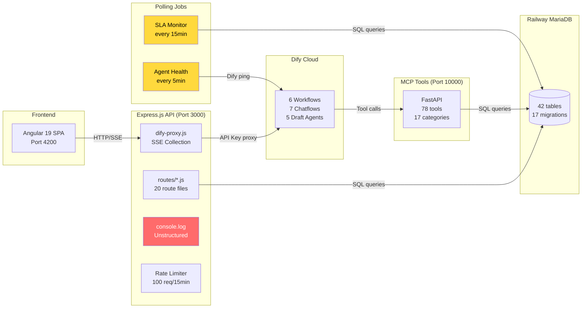
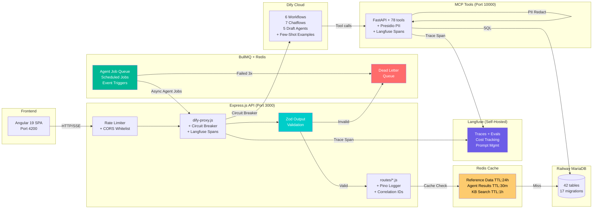
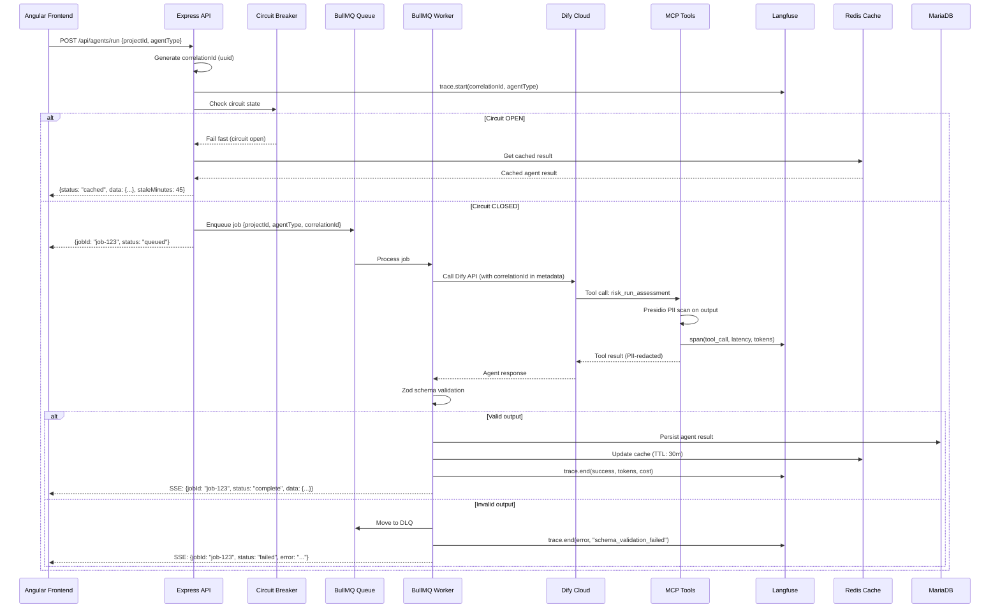
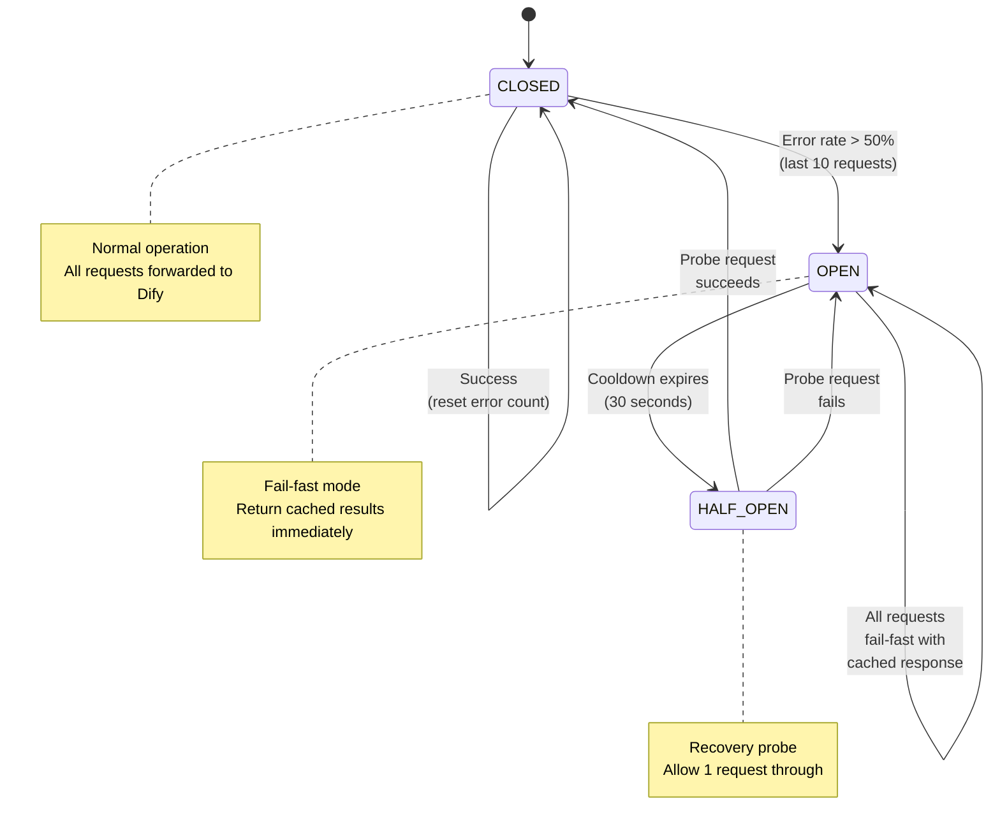

# Agentic Architecture Audit: Gap Analysis & Implementation Roadmap

**Project:** COO Multi-Agent Workbench (NPA Approval Platform)
**Date:** 2026-02-28
**Stack:** Dify AI + Express.js + Angular 19 + MariaDB + MCP Python (FastAPI)
**Deployment:** Render (free tier) + Railway (MariaDB)

---

## Table of Contents

1. [Executive Summary](#1-executive-summary)
2. [Current Architecture (As-Is)](#2-current-architecture-as-is)
3. [Industry Best Practices (To-Be)](#3-industry-best-practices-to-be)
4. [Gap Analysis Matrix](#4-gap-analysis-matrix)
5. [Recommended Open-Source Stack](#5-recommended-open-source-stack)
6. [Phased Implementation Roadmap](#6-phased-implementation-roadmap)
7. [Architecture Diagrams](#7-architecture-diagrams)

---

## 1. Executive Summary

The NPA Multi-Agent Workbench orchestrates **18 Dify AI agents** (6 Workflows + 7 Chatflows + 5 Draft Builder agents) through an Express.js proxy, backed by **78 MCP tools** and a **42-table MariaDB schema**. The core agent orchestration is functional — agents run, results persist to DB, and the Angular frontend renders them.

However, the architecture lacks **5 critical production pillars** that separate a working prototype from a true agentic system:

| Pillar | What's Missing |
|--------|---------------|
| **Observability** | No structured logging, no distributed tracing, no LLM cost/latency metrics |
| **Resilience** | No circuit breakers, no dead letter queues, no fallback chains |
| **Evaluation** | No golden datasets, no regression testing, no automated output validation |
| **Security** | No PII redaction, CORS unrestricted, no output content filtering |
| **Automation** | No job queues, no event-driven triggers, no scheduled re-assessments |

### Architecture Maturity Scorecard

| Dimension | Score | Rating | Industry Target |
|-----------|-------|--------|----------------|
| Observability | 1/5 | Console.log only | Langfuse + structured logging + correlation IDs |
| Resilience | 2/5 | Rate limits + timeouts | Circuit breakers + DLQ + fallback chains |
| Evaluation | 1/5 | Manual testing only | Golden datasets + promptfoo CI/CD + schema validation |
| Security | 3/5 | JWT + Helmet + rate limiting | + PII redaction + CORS restriction + output validation |
| Automation | 2/5 | Polling-based SLA/health | BullMQ job queue + event-driven triggers + cron |
| Context Engineering | 3/5 | 16 prompt files + 78 MCP tools | + dynamic context assembly + few-shot injection |
| Data Architecture | 3/5 | 42 tables, 17 migrations | + Redis caching + query result TTL |
| **Overall** | **2.1/5** | **Prototype** | **Production-grade agentic system** |

---

## 2. Current Architecture (As-Is)

### 2.1 Observability

**Rating: 1/5 — Console-based logging only**

| What Exists | Details | File |
|------------|---------|------|
| Ad-hoc console logging | `console.log()` / `console.error()` throughout all 35 server files. Unstructured, no timestamps, no severity levels. | `server/index.js` (35+ log calls) |
| Log prefixes | Informal tags like `[ENV]`, `[HEALTH]`, `[MIGRATION]` but not parseable by log aggregators | All route files |
| Agent health polling | In-memory health state per agent. Pings Dify every 5 min with 10s timeout. Tracks latency, failure count, uptime. **Not exported to any metrics system.** | `server/jobs/agent-health.js:11-33` |
| Frontend activity tracking | RxJS `agentActivity$` subject in Angular, but no request correlation across layers | `src/app/services/dify/dify.service.ts` |

**What's completely missing:**
- No structured logging framework (Winston, Pino, Morgan)
- No distributed tracing — no correlation IDs linking Frontend → Express → Dify → MCP
- No LLM observability (token counts, costs, latencies per agent call)
- No metrics export (Prometheus, Datadog, Grafana)
- No alerting on agent failures or latency spikes
- SSE stream collection in `dify-proxy.js:299-373` captures chunks but doesn't tag them with parent request IDs

### 2.2 Resilience

**Rating: 2/5 — Basic rate limiting and timeouts**

| What Exists | Details | File |
|------------|---------|------|
| Rate limiting | `express-rate-limit`: General 100/15min, Auth 10/15min, Agents 30/15min | `server/index.js:77-107` |
| Request timeouts | 30s for standard APIs, 600s (10min) for Dify/seed routes | `server/index.js:109-122` |
| DB connection pool | mysql2 pool: 10 connections, 50 queue limit, 5s connect timeout, 60s idle timeout, keepalive every 30s | `server/db.js:4-17` |
| DB keepalive ping | `SELECT 1` every 60s to detect stale connections | `server/index.js:469-475` |
| Frontend RxJS retry | Imports `retry`, `retryWhen`, `timer` from RxJS for HTTP retries | `src/app/services/dify/dify.service.ts` |

**What's completely missing:**
- **No circuit breaker** — when Dify is down, requests timeout after 120-600s instead of failing fast
- **No exponential backoff** — MCP tool failures cause Dify to immediately retry, wasting iterations
- **No dead letter queue** — failed agent outputs are dropped or returned as `SHOW_ERROR` (not retryable)
- **No fallback chains** — no primary→secondary LLM routing
- **No graceful degradation** — when Dify is unavailable, UI shows spinners indefinitely (DB-first strategy mitigates this partially)

### 2.3 Evaluation & Testing

**Rating: 1/5 — Manual testing only**

| What Exists | Details | File |
|------------|---------|------|
| Smoke test | Basic endpoint connectivity test | `server/tests/smoke-test.js` |
| Sign-off agent test | Validates sign-off workflow | `server/tests/signoff-agents.test.js` |
| Manual agent test report | Tested 6 agents against 1 NPA, documented failures | `AGENT-TEST-REPORT.md` |
| Seed data | 5 pre-built NPAs for manual testing | `database/seed-npa-*.sql` (5 files) |
| Frontend test | Single `app.spec.ts` test file | `src/app/app.spec.ts` |

**What's completely missing:**
- **No golden dataset** — no set of NPAs with known-correct agent outputs
- **No prompt regression testing** — prompt changes (v1→v2) are untested before deployment
- **No automated output schema validation** — agents can return arbitrary JSON without validation
- **No CI/CD test pipeline** — no tests run on push/PR
- **No A/B testing framework** — no way to compare prompt versions
- **No agentic metrics** — no tool-call success rate, no task completion rate

### 2.4 Security

**Rating: 3/5 — Good basics, missing advanced protections**

| What Exists | Details | File |
|------------|---------|------|
| JWT authentication | HS256 JWT with 7-day expiry. Secret from env var with dev fallback. | `server/middleware/auth.js:17-18` |
| RBAC middleware | Role-based access control checks | `server/middleware/rbac.js` |
| Helmet security headers | CSP, HSTS (1 year), X-Frame-Options DENY, X-Content-Type-Options | `server/index.js:29-59` |
| Rate limiting | Three-tier rate limits (general, auth, agents) | `server/index.js:77-107` |
| Server-side API keys | All Dify keys stored in env vars, proxied through Express — never exposed to frontend | `server/config/dify-agents.js:41` |
| Audit logging middleware | Logs POST/PUT/PATCH/DELETE mutations with user, action, resource | `server/middleware/audit.js` |
| Input validation (Zod) | Validates autofill batch requests with field length limits and enum checks | `server/validation/autofill-schema.js` |

**What's missing or concerning:**
- **CORS unrestricted** — `app.use(cors())` with no origin whitelist allows any domain to call the API (`server/index.js:62`)
- **Demo password hardcoded** — `DBS@2026` in source code (`server/middleware/auth.js:19`)
- **JWT secret has dev fallback** — `'coo-workbench-dev-secret-2026'` used if env var missing (`server/middleware/auth.js:17`)
- **No PII scrubbing** — agent outputs containing names, emails, account numbers are stored verbatim in DB
- **No prompt injection defense** — user inputs forwarded to Dify without sanitization
- **No output content filtering** — Dify responses returned to frontend without validation
- **Audit logging is fire-and-forget** — DB insert errors in audit middleware are caught but silently dropped

### 2.5 Scheduling & Automation

**Rating: 2/5 — Basic polling, no event-driven patterns**

| What Exists | Details | File |
|------------|---------|------|
| SLA monitor | Runs every 15 min. Detects breached signoff deadlines, flags validity expiry. Uses DB transactions. | `server/jobs/sla-monitor.js` (306 lines) |
| Agent health monitor | Runs every 5 min. Pings all Dify agents, tracks uptime/latency in memory. | `server/jobs/agent-health.js` |
| DB keepalive | Pings DB every 60s with `SELECT 1` | `server/index.js:469-475` |

**What's completely missing:**
- **No job queue** — no BullMQ, RabbitMQ, or Celery. All long-running operations block HTTP responses
- **No event-driven triggers** — agent completions don't trigger downstream agents or workflows
- **No scheduled re-assessments** — risk scores, monitoring metrics, and governance status are never automatically refreshed
- **No webhook support** — no way for external systems to trigger agent runs
- **SLA monitor is not idempotent** — if it crashes mid-update, could create duplicate breach alerts

### 2.6 Context Engineering

**Rating: 3/5 — Strong prompt library, weak dynamic assembly**

| What Exists | Details | File |
|------------|---------|------|
| Prompt library (v2) | 16 prompt files covering all agents with structured output format requirements | `Context/Dify_Agent_Prompts_v2/` (16 files) |
| MCP tools server | 78 tools across 17 categories (FastAPI + aiomysql). Tools provide real DB data to agents. | `server/mcp-python/tools/` (21 modules) |
| Agent registry | Maps 18 logical agents to Dify API keys with type/tier metadata | `server/config/dify-agents.js`, `shared/agent-registry.json` |
| Chatflow default inputs | Pre-fills required Dify variables (session_id, project_id, user_role, current_stage) | `server/routes/dify-proxy.js:55-73` |
| @@NPA_META@@ envelope | Structured response extraction from Chatflow agent text | `server/routes/dify-proxy.js:77` |
| Wave orchestration | Frontend runs agents in dependency waves: RISK → [CLASSIFIER + ML_PREDICT] → GOVERNANCE → DOC_LIFECYCLE → MONITORING | `src/app/pages/npa-agent/npa-detail/npa-detail.component.ts` |

**What's missing:**
- **No dynamic context assembly** — same prompt + full KB sent regardless of NPA type/domain
- **No few-shot example injection** — agents have no examples of expected input→output pairs in prompts
- **No context window management** — no checks for token overflow before sending to Dify
- **No context pruning** — irrelevant KB documents still sent to agents
- **Prompt versioning unclear** — v1 and v2 folders exist, but unclear which is active in Dify

### 2.7 Data Architecture

**Rating: 3/5 — Comprehensive schema, no caching layer**

| What Exists | Details | File |
|------------|---------|------|
| MariaDB schema | 42 tables covering core NPA data, reference tables, agent results, audit trail | `database/schema-only.sql` |
| 17 migrations | Incremental schema evolution from 002 to 017 | `database/migrations/` |
| Auto-migrations at startup | Creates agent summary tables + adds missing columns on Express boot | `server/index.js:260-440` |
| Connection pool | mysql2 pool with 10 connections, keepalive, idle timeout | `server/db.js` |
| Frontend stale detection | Checks `agentResults` timestamps against 30-min threshold | `npa-detail.component.ts` |
| DB-first loading strategy | Load cached data immediately, refresh stale data in background | `npa-detail.component.ts` |

**What's missing:**
- **No Redis or in-memory cache** — every page load re-queries the same DB data
- **No query result caching** — reference tables (criteria, rules, templates) queried repeatedly
- **No cache invalidation strategy** — background Dify refresh doesn't purge stale cache
- **No data export/backup automation** — manual disaster recovery
- **Migration rollback not supported** — one-way forward-only migrations

---

## 3. Industry Best Practices (To-Be)

### 3.1 Observability — What Production Systems Do

**LLM Observability (Langfuse / Phoenix / LangSmith):**
Production agentic systems use dedicated LLM observability platforms that capture every agent invocation as a **trace** containing:
- Input prompt, output response, token counts (input/output/total)
- Latency per step (LLM call, tool use, retrieval)
- Cost per invocation (model pricing × tokens)
- Tool call sequences (which MCP tools called, in what order, with what results)
- Error classification (timeout, rate limit, invalid output, hallucination)

**Langfuse** is the recommended choice for Dify stacks because:
- **Native Dify integration**: Configure in Dify Settings → Monitoring → paste Langfuse keys. Automatically captures all traces.
- **Self-hostable**: Run on Render for free (Docker image available)
- **JS + Python SDKs**: Instrument Express.js proxy AND MCP Python server
- **Evaluations built-in**: Score traces with custom metrics, track prompt versions

**Structured Logging (Pino):**
Replace all `console.log()` with structured JSON logging:
```json
{"level":"info","time":1709136000,"msg":"Dify workflow started","correlationId":"req-abc123","agentId":"RISK","projectId":"NPA-2026-001","latencyMs":null}
```

Benefits: parseable by Datadog/ELK/Loki, filterable, alertable, correlatable across services.

**Correlation IDs:**
Every request gets a unique `X-Request-ID` header that flows through:
```
Angular → Express (X-Request-ID) → Dify (metadata) → MCP Tools (header) → DB (audit log)
```
This enables end-to-end tracing of a single user action across all services.

### 3.2 Resilience — What Production Systems Do

**Circuit Breaker Pattern:**
A state machine that detects systemic failures and stops hammering failing services:

```
CLOSED (normal) → error rate > 50% → OPEN (fail-fast for 30s)
                                           ↓ cooldown expires
                                      HALF_OPEN (allow 1 probe request)
                                           ↓ success → CLOSED
                                           ↓ failure → OPEN
```

Implementation: Track last N Dify API calls. If >50% failed in last 60s, trip the circuit. Return cached/fallback response immediately instead of waiting 120s for timeout.

**Exponential Backoff with Jitter:**
When a transient failure occurs (HTTP 429, 503), retry with increasing delays:
- Attempt 1: wait 250ms
- Attempt 2: wait 500ms + random(0-100ms)
- Attempt 3: wait 1000ms + random(0-200ms)
- Max 3 retries, then fail to DLQ

The jitter prevents "thundering herd" — all clients retrying at the same time.

**Dead Letter Queue (DLQ):**
Failed agent runs are captured in a retry queue (BullMQ) with full context:
- Original input, agent ID, error message, failure timestamp, retry count
- After max retries (3), moved to DLQ for manual review
- Dashboard shows DLQ depth as a health indicator

**Graceful Degradation:**
When Dify is completely unavailable:
1. Return last cached agent results from DB (already implemented via DB-first strategy)
2. Show "Results from [timestamp], AI analysis temporarily unavailable" banner
3. Queue the refresh request for when service recovers

### 3.3 Evaluation — What Production Systems Do

**Golden Dataset:**
A curated set of 20-30 NPA test cases with **expert-verified expected outputs** for each agent:
- 5 NPAs with HIGH risk (expected: hard-stop flags, elevated signoff routing)
- 5 NPAs with LOW risk (expected: lite track, minimal signoffs)
- 5 NPAs with edge cases (cross-border, evergreen, bundled products)
- 5 NPAs with incomplete data (expected: graceful handling, explicit unknowns)
- 5-10 adversarial inputs (prompt injection attempts, off-topic queries)

**Prompt Regression Testing (promptfoo):**
```yaml
# promptfoo.yaml
providers:
  - id: dify-risk-agent
    config:
      url: https://api.dify.ai/v1/workflows/run
      apiKey: ${DIFY_KEY_RISK}

tests:
  - vars:
      project_id: "NPA-2026-001"
    assert:
      - type: json-schema
        value: { "type": "object", "required": ["overallScore", "overallRating", "domainAssessments"] }
      - type: contains
        value: "MARKET"
      - type: llm-rubric
        value: "Output must contain domain risk scores for at least 4 domains"
```

Run on every prompt change (`promptfoo eval`), block deployment if regressions detected.

**Output Schema Validation:**
Every agent output is validated against a JSON Schema before persistence:
- RISK: must have `overallScore` (number), `overallRating` (enum), `domainAssessments` (array)
- CLASSIFIER: must have `tier`, `track`, `overallConfidence` (0-100)
- ML_PREDICT: must have `approvalLikelihood`, `timelineDays`, `bottleneckDept`

Invalid outputs → logged to DLQ for investigation, cached data preserved on frontend.

### 3.4 Security — What Production Systems Do

**PII Detection & Redaction (Microsoft Presidio):**
Before sending user inputs to Dify, and before storing Dify outputs in DB:
```
Input:  "Contact Finance VP John Smith at john.smith@dbs.com for NPA-2026-001"
Output: "Contact Finance VP <PERSON> at <EMAIL> for NPA-2026-001"
```

Presidio detects: names, emails, phone numbers, credit card numbers, SSNs, IP addresses, dates of birth.
Redaction modes: mask (`<PERSON>`), hash (`a1b2c3`), or encrypt (reversible with key).

**Prompt Injection Defense (OWASP LLM Top 10 #1):**
- **Input sanitization**: Strip markdown code blocks, encoded payloads, known attack patterns
- **Instruction hierarchy**: System prompt takes priority over user input (enforced in Dify prompt design)
- **Output validation**: Detect if agent output contains instructions to the user that weren't in the original prompt
- **Tool-use authorization**: Each agent can only call whitelisted MCP tools (enforced at MCP server level)

**CORS Restriction:**
Replace `app.use(cors())` with:
```javascript
app.use(cors({
  origin: ['https://npa-workbench.onrender.com', 'http://localhost:4200'],
  credentials: true
}));
```

### 3.5 Automation — What Production Systems Do

**Job Queue (BullMQ + Redis):**
Long-running agent calls should be asynchronous:
1. Client POSTs `/api/agents/run` → returns `{ jobId: "..." }` immediately
2. BullMQ worker processes the Dify call in background
3. Client polls `/api/agents/jobs/:jobId` or subscribes via SSE
4. On completion, result persisted to DB and client notified

Benefits: No HTTP timeout issues, automatic retries, DLQ, job prioritization, concurrency control.

**Event-Driven Triggers:**
```
NPA stage changes → trigger: re-run GOVERNANCE agent
Risk score exceeds threshold → trigger: send NOTIFICATION
Document uploaded → trigger: re-run DOC_LIFECYCLE validation
SLA breached → trigger: create ESCALATION + notify stakeholders
```

**Scheduled Re-assessments:**
```
Daily 02:00 UTC  → Re-run MONITORING for all ACTIVE NPAs
Weekly Monday    → Re-run RISK for all NPAs in PENDING_SIGN_OFFS
Monthly 1st      → Generate compliance report via AUDIT agent
```

### 3.6 Context Engineering — What Production Systems Do

**Dynamic Context Assembly:**
Instead of sending the same KB to all agents, assemble context per NPA:
```
NPA type = "Custody Services" + risk_level = "HIGH" + is_cross_border = true
  → Include: custody_regulations.pdf, cross_border_rules.pdf, high_risk_procedures.pdf
  → Exclude: retail_banking.pdf, low_risk_templates.pdf
```

**Few-Shot Example Injection:**
Include 2-3 input/output examples in the system prompt wrapped in XML:
```xml
<examples>
  <example>
    <input>NPA for cross-border FX product, notional $50M, HIGH risk</input>
    <output>{"overallScore": 78, "overallRating": "HIGH", "hardStop": false, ...}</output>
  </example>
</examples>
```

This dramatically improves output format consistency and reduces parsing failures.

**Structured Output Enforcement:**
Dify Workflows support JSON output mode. For ReAct agents that lack this, add to system prompt:
```
CRITICAL: Your final response MUST be a single valid JSON object.
Do NOT wrap in markdown code blocks.
Do NOT include explanation text before or after the JSON.
```

### 3.7 Data Architecture — What Production Systems Do

**Redis Caching Layer:**
```
Redis cache (TTL-based):
  ├── ref:criteria       (TTL: 24h)  — classification criteria rarely change
  ├── ref:rules          (TTL: 24h)  — document/escalation rules
  ├── ref:templates      (TTL: 24h)  — NPA templates
  ├── npa:{id}:summary   (TTL: 30m)  — NPA project summary
  ├── agent:{id}:result  (TTL: 30m)  — last agent result per NPA
  └── kb:search:{hash}   (TTL: 1h)   — KB search results
```

Cache invalidation: When an agent result is persisted to DB, invalidate the corresponding cache key.

---

## 4. Gap Analysis Matrix

| ID | Category | Gap | Current State | Target State | Severity | Effort |
|----|----------|-----|---------------|-------------|----------|--------|
| G-01 | Observability | No structured logging | `console.log()` everywhere | Pino JSON logger with correlation IDs | HIGH | S |
| G-02 | Observability | No LLM tracing | Zero visibility into Dify agent internals | Langfuse traces for every agent call | CRITICAL | S |
| G-03 | Observability | No metrics export | Agent health in-memory only | Langfuse dashboard + custom metrics | HIGH | M |
| G-04 | Observability | No correlation IDs | Cannot trace request across services | X-Request-ID propagated to all services | HIGH | S |
| G-05 | Resilience | No circuit breaker | 120-600s timeout on Dify failure | CLOSED→OPEN→HALF_OPEN state machine | CRITICAL | M |
| G-06 | Resilience | No exponential backoff | Immediate retry (wastes Dify iterations) | Backoff with jitter (250ms → 500ms → 1s) | HIGH | S |
| G-07 | Resilience | No dead letter queue | Failed agent outputs dropped | BullMQ DLQ with full context for replay | HIGH | M |
| G-08 | Resilience | No fallback chain | Single Dify endpoint, no degradation | Cached response fallback when Dify down | MEDIUM | M |
| G-09 | Evaluation | No golden dataset | 1 test NPA, manual verification | 20-30 NPAs with expert-verified outputs | CRITICAL | L |
| G-10 | Evaluation | No regression testing | Prompt changes untested | promptfoo in CI/CD, blocks bad deployments | CRITICAL | M |
| G-11 | Evaluation | No output schema validation | Agents can return arbitrary JSON | JSON Schema validation per agent type | HIGH | S |
| G-12 | Security | No PII redaction | Names/emails stored verbatim from agents | Presidio detection + masking on input/output | HIGH | M |
| G-13 | Security | CORS unrestricted | `cors()` allows all origins | Whitelist: Render domain + localhost | HIGH | S |
| G-14 | Security | Demo password hardcoded | `DBS@2026` in source code | Move to env var (already partially done) | MEDIUM | S |
| G-15 | Security | JWT secret has dev fallback | Falls back to hardcoded string if env missing | Require env var, fail startup if missing | MEDIUM | S |
| G-16 | Security | No prompt injection defense | User input forwarded raw to Dify | Input sanitization + instruction hierarchy | MEDIUM | M |
| G-17 | Security | No output content filtering | Dify responses returned without validation | Validate output against expected schema | MEDIUM | S |
| G-18 | Automation | No job queue | Long-running ops block HTTP responses | BullMQ + Redis for async agent jobs | HIGH | L |
| G-19 | Automation | No event-driven triggers | Agents don't trigger downstream actions | Event bus: stage change → re-run governance | MEDIUM | M |
| G-20 | Automation | No scheduled re-assessments | Risk/monitoring never auto-refreshed | Cron: nightly monitoring, weekly risk | MEDIUM | M |
| G-21 | Automation | SLA monitor not idempotent | Could duplicate breach alerts on crash | Add idempotency keys to SLA job | MEDIUM | S |
| G-22 | Context | No dynamic context assembly | Same KB sent regardless of NPA type | Scope KB to product category + risk level | MEDIUM | L |
| G-23 | Context | No few-shot examples in prompts | Agents have zero examples of expected I/O | Add 2-3 examples per agent prompt | HIGH | M |
| G-24 | Context | No context window management | No token overflow detection | Calculate token count before Dify call | LOW | S |
| G-25 | Data | No caching layer | Every page load re-queries DB | Redis cache for reference data + agent results | MEDIUM | M |
| G-26 | Data | No cache invalidation | Stale data persists until page reload | Invalidate on agent result persistence | MEDIUM | S |
| G-27 | Data | No migration rollback | Forward-only SQL migrations | Add down() migration support | LOW | L |

**Summary: 27 gaps identified**
- CRITICAL: 4 (G-02, G-05, G-09, G-10)
- HIGH: 11 (G-01, G-03, G-04, G-06, G-07, G-11, G-12, G-13, G-18, G-23)
- MEDIUM: 10 (G-08, G-14, G-15, G-16, G-17, G-19, G-20, G-21, G-25, G-26)
- LOW: 2 (G-24, G-27)

---

## 5. Recommended Open-Source Stack

### Technology Selection Matrix

| Category | Chosen Tool | Alternatives Considered | Why This One |
|----------|------------|------------------------|-------------|
| **LLM Observability** | **Langfuse** (v3) | Phoenix (Arize), LangSmith | Native Dify integration (1-click setup). Self-hostable on Render. JS + Python SDKs for both Express and MCP server. Includes evaluations, prompt management, cost tracking. Phoenix is better for local dev but lacks Dify integration. LangSmith is LangChain-specific. |
| **Structured Logging** | **Pino** | Winston, Morgan, Bunyan | Fastest Node.js JSON logger (5x Winston). Zero-config JSON output. Low overhead for free-tier Render. Integrates with Datadog/ELK/Loki. |
| **Job Queue** | **BullMQ** | Agenda, node-cron, RabbitMQ | Node.js native. Redis-backed (shared with caching). Automatic retries, DLQ, parent-child jobs, cron patterns. Battle-tested (10K+ GitHub stars). RabbitMQ is overkill for our scale. |
| **Caching** | **Redis** (via Render) | Memcached, Node-cache | BullMQ already requires Redis. Multi-purpose: caching + job queue + pub/sub. Render offers free Redis instance. |
| **Prompt Testing** | **promptfoo** | Humanloop, Braintrust | YAML-based (version-controllable). CI/CD native. A/B comparison. Red teaming. Free and open-source. Works with any API (including Dify endpoints). |
| **Agent Evaluation** | **DeepEval** | Ragas, HELM | 50+ built-in metrics including 6 agentic-specific metrics. LLM-as-judge for subjective quality. Python-based (runs alongside MCP server). |
| **PII Redaction** | **Presidio** (Microsoft) | spaCy NER, custom regex | Enterprise-grade. Regex + NER + context-aware detection. Detects 20+ PII types. Python SDK (MCP server integration). Battle-tested at Microsoft scale. |
| **Output Validation** | **Zod** (expand existing) | Guardrails AI, Joi, AJV | Already used in `server/validation/autofill-schema.js`. Extend to all agent output types. No new dependency needed. |
| **Circuit Breaker** | **opossum** | cockatiel, custom | Proven Node.js circuit breaker (Netflix Hystrix-inspired). Prometheus metrics export. Minimal footprint. |

### Dependency Summary

**Express.js (server/package.json):**
```
pino + pino-pretty     — structured logging
bullmq + ioredis       — job queue + Redis client
opossum                — circuit breaker
langfuse               — LLM observability SDK
uuid                   — correlation ID generation
```

**MCP Python (server/mcp-python/requirements.txt):**
```
langfuse               — LLM observability SDK
presidio-analyzer      — PII detection
presidio-anonymizer    — PII redaction
deepeval               — agent evaluation metrics
```

**No new infrastructure required** — Redis is the only new service (free on Render).

---

## 6. Phased Implementation Roadmap

### Phase 1: Observability Foundation (Week 1-2)

**Goal:** Replace console.log with structured logging. Add LLM tracing. Enable correlation IDs.

| Task | Gap IDs | Effort | Details |
|------|---------|--------|---------|
| Install Pino, replace all `console.log` in server | G-01 | 4h | Create `server/lib/logger.js`, import across 35 files. JSON output in production, pretty-print in dev. |
| Add correlation ID middleware | G-04 | 2h | Generate `X-Request-ID` (uuid v4) at entry, attach to `req`, propagate to all downstream calls. Log with every message. |
| Configure Langfuse in Dify | G-02 | 1h | Dify Settings → Monitoring → Langfuse. Paste `LANGFUSE_PUBLIC_KEY` + `LANGFUSE_SECRET_KEY`. All Dify traces auto-captured. |
| Instrument dify-proxy.js with Langfuse JS SDK | G-02, G-03 | 4h | Wrap `collectWorkflowSSEStream()` and chatflow calls with Langfuse spans. Track agent_id, project_id, latency, tokens, cost. |
| Instrument MCP Python server with Langfuse Python SDK | G-02 | 3h | Decorate tool functions with `@observe()`. Track tool latency, input/output, errors. |
| Create Langfuse dashboard | G-03 | 2h | Custom views: Agent success rate, avg latency, cost per agent, error trends. |

**Verification:** After Phase 1, every Dify agent call should appear as a trace in Langfuse with full context. Structured logs should be parseable by `jq`.

### Phase 2: Resilience & Async (Week 3-4)

**Goal:** Add circuit breaker for Dify calls. Implement BullMQ for async jobs. Add DLQ.

| Task | Gap IDs | Effort | Details |
|------|---------|--------|---------|
| Add Redis to Render | G-18, G-25 | 1h | Create Redis instance on Render free tier. Add `REDIS_URL` to env vars. |
| Implement circuit breaker middleware | G-05 | 4h | Wrap Dify API calls with `opossum`. Config: errorThresholdPercentage=50, resetTimeout=30000. On OPEN state, return cached DB results. |
| Add BullMQ job queue for agent runs | G-18 | 8h | Create `server/queues/agent-queue.js`. POST `/api/agents/run` → enqueue job → return jobId. Worker calls Dify, persists result. Client polls `/api/agents/jobs/:id`. |
| Implement DLQ for failed agent runs | G-07 | 4h | BullMQ `failedHandler` → move to DLQ after 3 attempts. Store: input, agentId, error, timestamp. Expose `/api/admin/dlq` for manual review. |
| Add exponential backoff to MCP tool calls | G-06 | 2h | In MCP Python `rest_server.py`, wrap DB queries with 3-attempt backoff (250ms, 500ms, 1s + jitter). |
| Make SLA monitor idempotent | G-21 | 2h | Add `idempotency_key` (hash of project_id + check_type + date) to breach alerts. Skip if key already exists. |

**Verification:** Trip the circuit breaker by simulating Dify downtime (invalid API key). Verify fallback to cached results within 100ms instead of 120s timeout. Verify DLQ captures failed jobs.

### Phase 3: Evaluation & Security (Week 5-6)

**Goal:** Create golden dataset. Add regression tests. Add PII redaction. Fix CORS.

| Task | Gap IDs | Effort | Details |
|------|---------|--------|---------|
| Create golden dataset (20-30 NPAs) | G-09 | 8h | Create `tests/golden/` with JSON files. Each NPA has: input (project data), expected output per agent (schema + key assertions). Include edge cases and adversarial inputs. |
| Set up promptfoo regression tests | G-10 | 6h | Create `promptfoo.yaml` with test cases per agent. Assert: JSON schema, required fields, value ranges. Run: `npx promptfoo eval`. |
| Add output schema validation (Zod) | G-11, G-17 | 4h | Create `server/validation/agent-schemas.js` with Zod schemas for RISK, CLASSIFIER, ML_PREDICT, GOVERNANCE, DOC_LIFECYCLE, MONITORING outputs. Validate in `handleAgentResult()`. |
| Add Presidio PII redaction | G-12 | 6h | In MCP Python server: add `pii_redactor.py` middleware. Scan agent outputs before returning to Express. Modes: mask names/emails in logs, preserve in DB with `pii_detected` flag. |
| Restrict CORS origins | G-13 | 1h | Replace `cors()` with `cors({ origin: [process.env.FRONTEND_URL, 'http://localhost:4200'] })`. Add `FRONTEND_URL` env var. |
| Fix hardcoded secrets | G-14, G-15 | 1h | Remove `DBS@2026` default. Require `JWT_SECRET` env var (fail startup if missing). Move demo password to env. |
| Add few-shot examples to prompts | G-23 | 4h | For each of 6 agent prompts in `Context/Dify_Agent_Prompts_v2/`, add 2-3 `<example>` blocks showing expected input→output. |

**Verification:** Run `npx promptfoo eval` — all golden tests should pass. Verify PII is masked in Langfuse traces. Verify CORS rejects requests from unauthorized origins.

### Phase 4: Automation & Optimization (Week 7-8)

**Goal:** Add scheduled re-assessments. Add event-driven triggers. Add Redis caching.

| Task | Gap IDs | Effort | Details |
|------|---------|--------|---------|
| Add scheduled agent re-runs | G-20 | 6h | BullMQ repeatable jobs: `monitoring` every 24h for ACTIVE NPAs, `risk` weekly for PENDING_SIGN_OFFS. Use `server/queues/scheduled-agents.js`. |
| Add event-driven triggers | G-19 | 8h | When `workflow_transition()` changes NPA stage → enqueue relevant agent re-run. When risk score > threshold → enqueue notification. Implement as Express middleware on mutation routes. |
| Add Redis caching layer | G-25, G-26 | 6h | Cache reference tables (criteria, rules, templates) with 24h TTL. Cache NPA summaries with 30min TTL. Cache agent results with 30min TTL. Invalidate on agent result persistence. |
| Add dynamic context scoping | G-22 | 6h | In `dify-proxy.js`, before Dify call: query NPA type + risk level → select relevant KB documents → pass as Dify inputs. Reduces token usage and improves relevance. |

**Verification:** Verify scheduled jobs fire on time (check BullMQ dashboard). Verify cache hit rate > 80% for reference data. Verify event-driven triggers fire correctly on stage transitions.

### Timeline Summary

```
Week 1-2: Observability    ████████░░░░░░░░  (Pino + Langfuse + correlation IDs)
Week 3-4: Resilience       ░░░░░░░░████████  (Circuit breaker + BullMQ + DLQ + Redis)
Week 5-6: Eval + Security  ░░░░░░░░░░░░████████  (Golden dataset + promptfoo + Presidio + CORS)
Week 7-8: Automation       ░░░░░░░░░░░░░░░░████████  (Scheduled jobs + events + caching)
```

**Total new dependencies:** 7 (pino, bullmq, ioredis, opossum, langfuse, uuid, presidio)
**Total new infrastructure:** 1 (Redis on Render free tier)
**Estimated effort:** ~100 hours across 8 weeks

---

## 7. Architecture Diagrams

### 7.1 Current Architecture (As-Is)



**Problems visible in this diagram:**
- No observability layer between any service
- No resilience layer around Dify calls
- No async job processing (everything synchronous)
- No caching between Express and MariaDB
- Polling jobs are the only automation

### 7.2 Target Architecture (To-Be)



### 7.3 Request Flow: Agent Run (Target State)



### 7.4 Resilience: Circuit Breaker State Machine



---

## Appendix A: Reference Comparison

| Practice | Palantir AIP | LangChain/LlamaIndex | Anthropic Guidelines | Our Target |
|----------|-------------|---------------------|---------------------|------------|
| LLM Observability | Proprietary AIP metrics | LangSmith traces | — | Langfuse (OSS, Dify-native) |
| Tool Orchestration | Ontology + Actions | Agent Executor + Tools | Tool Use API | MCP Tools (78 tools, FastAPI) |
| Context Engineering | MMDP Platform | RAG + Prompt Templates | Context Engineering Guide | Dynamic KB scoping + few-shot |
| Circuit Breaker | Internal infrastructure | LangChain fallbacks | — | opossum (Node.js) |
| PII Handling | Built-in DLP | — | — | Presidio (OSS) |
| Evaluation | Evaluation Suites | LangSmith Eval | — | promptfoo + DeepEval |
| Job Queue | Internal orchestration | — | — | BullMQ + Redis |
| Caching | Internal caching | — | Prompt caching API | Redis (reference data + results) |

## Appendix B: Files Modified Per Phase

**Phase 1 (Observability):**
- NEW: `server/lib/logger.js` — Pino logger factory
- NEW: `server/middleware/correlation-id.js` — X-Request-ID middleware
- EDIT: `server/index.js` — Replace console.log, add middleware
- EDIT: `server/routes/dify-proxy.js` — Add Langfuse spans
- EDIT: `server/mcp-python/rest_server.py` — Add Langfuse Python spans
- EDIT: All 20 route files — Replace console.log with logger

**Phase 2 (Resilience):**
- NEW: `server/lib/circuit-breaker.js` — opossum wrapper for Dify calls
- NEW: `server/queues/agent-queue.js` — BullMQ queue + worker
- NEW: `server/queues/dlq.js` — Dead letter queue handler
- NEW: `server/routes/jobs.js` — Job status API endpoints
- EDIT: `server/routes/dify-proxy.js` — Use circuit breaker
- EDIT: `server/jobs/sla-monitor.js` — Add idempotency keys
- EDIT: `render.yaml` — Add Redis service

**Phase 3 (Evaluation + Security):**
- NEW: `tests/golden/*.json` — Golden dataset (20-30 files)
- NEW: `promptfoo.yaml` — Regression test config
- NEW: `server/validation/agent-schemas.js` — Zod schemas for all 6 agents
- NEW: `server/mcp-python/pii_redactor.py` — Presidio middleware
- EDIT: `server/index.js` — CORS restriction, env var requirements
- EDIT: `server/middleware/auth.js` — Remove hardcoded secrets
- EDIT: `Context/Dify_Agent_Prompts_v2/*.md` — Add few-shot examples

**Phase 4 (Automation):**
- NEW: `server/queues/scheduled-agents.js` — Cron-based agent re-runs
- NEW: `server/middleware/event-triggers.js` — Stage change → agent re-run
- NEW: `server/lib/redis-cache.js` — Cache helper with TTL management
- EDIT: `server/routes/*.js` — Add cache layer to read endpoints
- EDIT: `server/routes/agents.js` — Cache invalidation on persist
